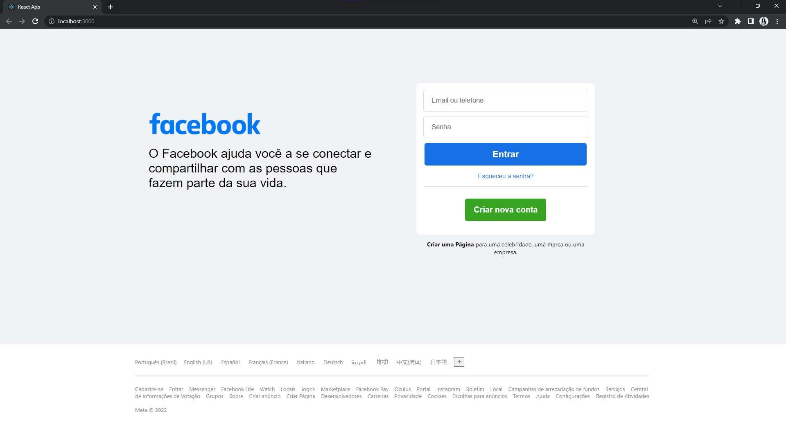

# Clone página inicial do Facebook

Este projeto é um artefato utilizado para exercitar o desenvolvimento FrontEnd

# Autor

Jonas Miranda

## Como utilizar

Para iniciar o projeto, deverá ser executado:

### `npm install`

### `npm start`

Inicia o app em modo desenvolvedor
Abra [http://localhost:3000](http://localhost:3000) para visualizar o projeto no navegador.

## Projeto

Tecnologias utilizadas:

- HTML
- SCSS
- React com typeScript

